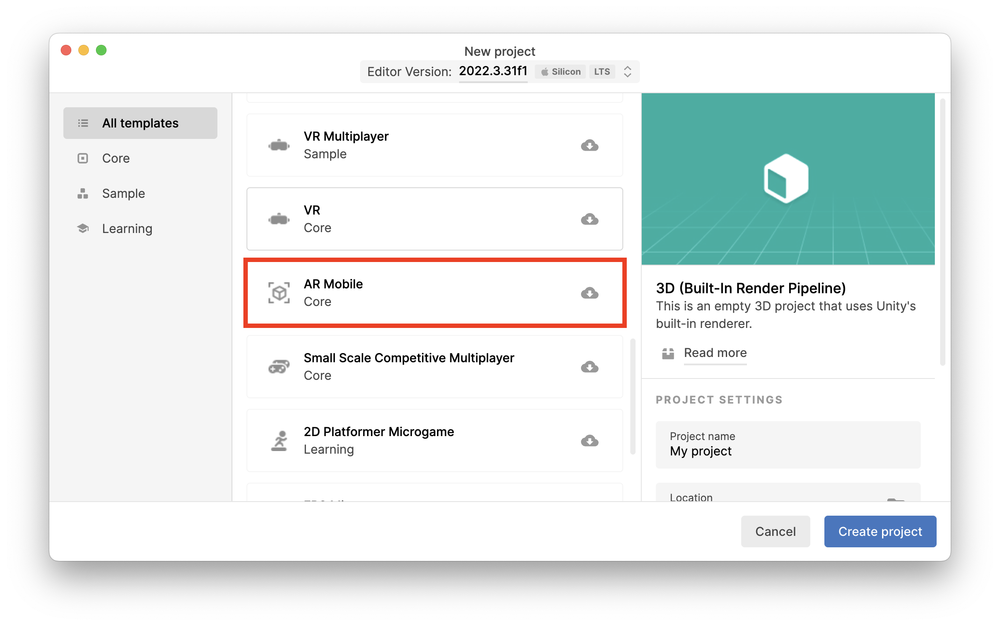

# Unidade 3

## Código de Barras para ancorar RA usando Ar Foundation

Ter:  

- ter no mínimo 3 produtos de volumes diferentes  
  - lata de refrigerante  
  - caixa de ...  
  - tubo de ...  
- tentar não usar marcadores do Vulforia  
- identificar o "produto" usando o código de barras  
- usar código de barras do "produto" para posicionar a âncora usando o Ar Foundation  

  
