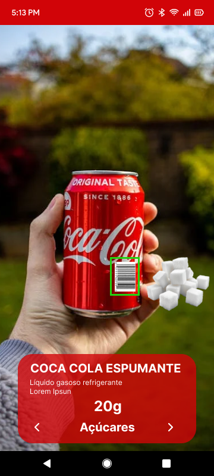

# Unidade 3

## Código de Barras para ancorar RA usando Ar Foundation

Ter:  

- ter no mínimo 3 produtos de volumes diferentes  
  - lata de refrigerante  
  - caixa de ...  
  - tubo de ...  
- tentar não usar marcadores do Vulforia  
- identificar o "produto" usando o código de barras  
- usar código de barras do "produto" para posicionar a âncora usando o Ar Foundation  

## Requisitos

### Requisitos Funcionais (RF)

- RF1. **Leitura de Códigos de Barras:**
   - O aplicativo deve permitir a leitura de códigos de barras usando a câmera do dispositivo.

- RF2. **Identificação de Produtos:**
   - Após a leitura do código de barras, o aplicativo deve identificar o produto correspondente em um banco de dados predefinido.

- RF3. **Exibição de Informações do Produto:**
   - O aplicativo deve exibir informações relevantes sobre o produto, como nome, descrição, macronutrientes.

- RF4. **Modo de Realidade Aumentada:**
   - O aplicativo deve oferecer uma visualização em realidade aumentada que destaque o produto e suas informações volumétricas de macronutrientes ao ser escaneado.

### Requisitos Não Funcionais

- RNF1. **Usabilidade:**
   - A interface do usuário deve ser intuitiva e fácil de navegar, permitindo que os usuários leiam códigos de barras.

- RNF2. **Compatibilidade:**
   - O aplicativo deve ser compatível com as principais plataformas móveis (iOS e Android) e versões recentes de sistemas operacionais.

   - Deve suportar os formatos de código de barras mais comuns (ex: UPC, EAN, QR Code).

- RNF3. **Manutenibilidade:**
   - O código do aplicativo deve ser bem documentado para facilitar atualizações e manutenção futura.

## Exemplo de execução:

